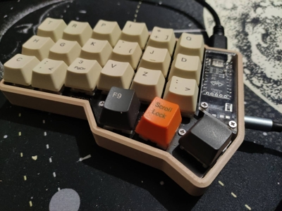

# CRKBD Firmware

The firmware for my Corne (or CRKBD) keyboard.

This repo has a `build.sh` that applies the patches to the `qmk_firmware` submodule. The three C source files (`rules.mk`, `config.h` and `keymap.c`) are put into a custom keymap directory in `qmk_firmware` by that same script, and then `qmk build` is run to compile them.

  

## Software requirements

Well, `qmk`.

## Hardware requirements

A [Corne keyboard](https://github.com/foostan/crkbd) that uses the ~~heavily unsupported~~ STeMCell v1.0.0 microcontroller.
This microcontroller is why we need to add `CONVERT_TO=stemcell -e STMC_US=yes` to the `qmk build` command and edit the `info.json` file to swap the `B1` and `B2` pins, yay!

LED lights are not supported, neither in keys (backlight) nor the underglow ones.
